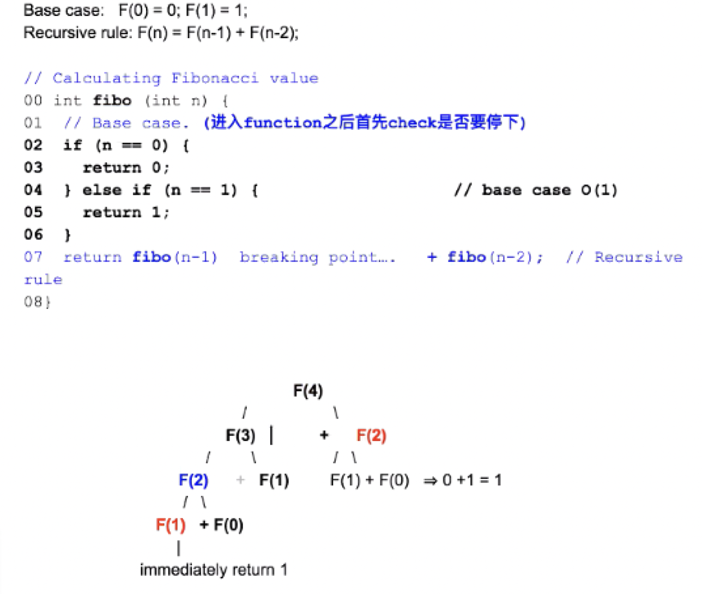
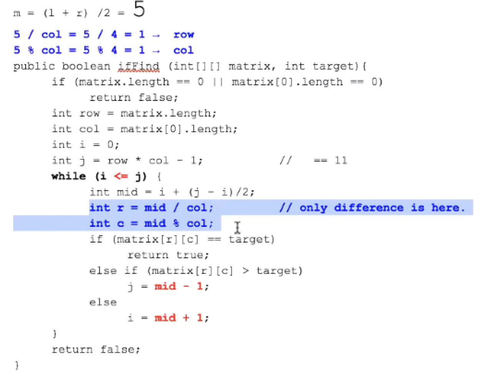
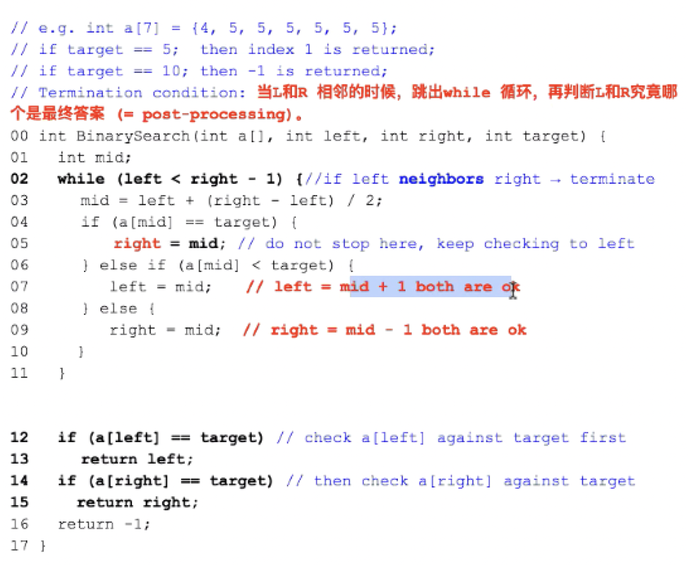
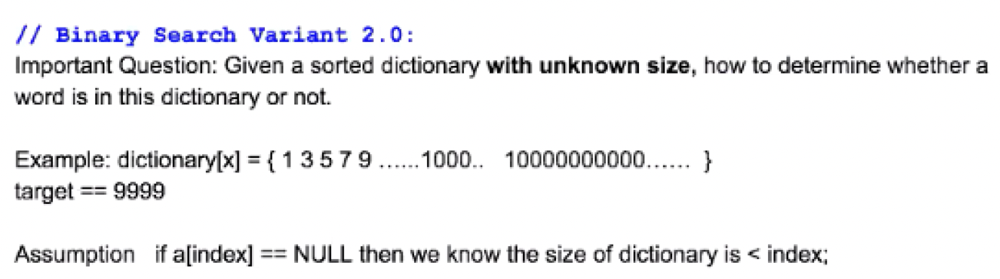
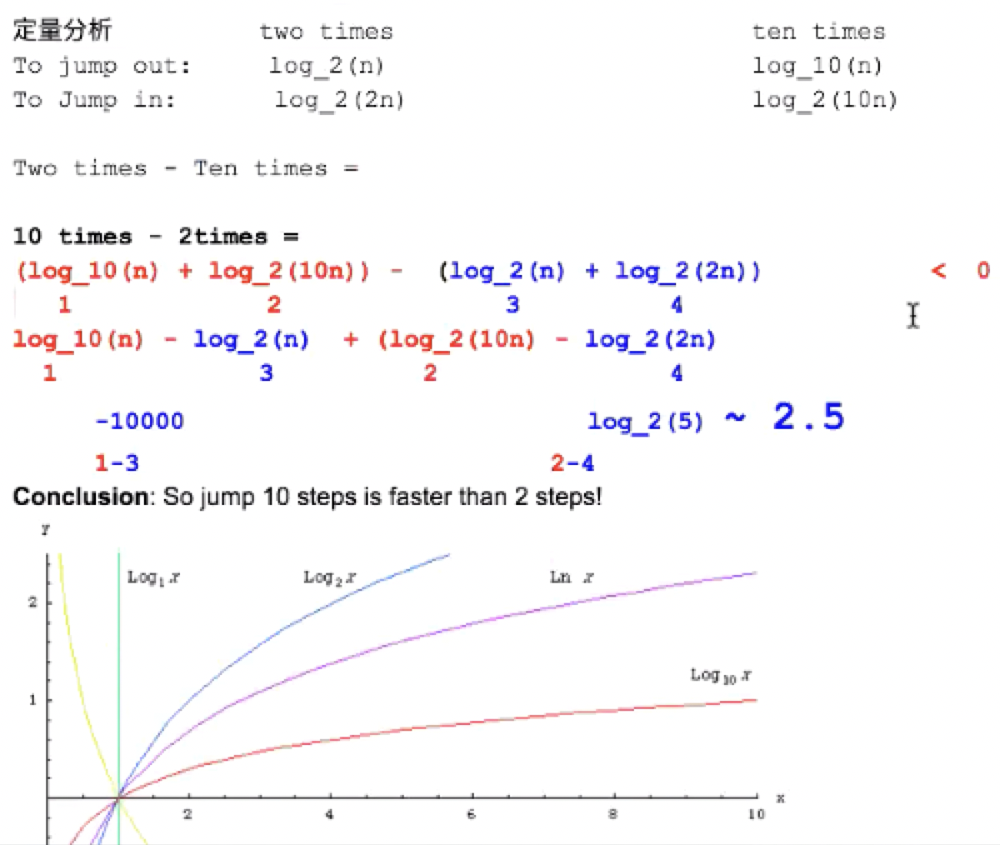

# Recursion

## 1. Fibonacci

<div align=center></div>

**Time Complexity: O(2<sup>n</sup>)** 

Total time: 1 + 2 + 4 + 8 + ... + 2<sup>n-1</sup> < 2<sup>n</sup>

**Space Complexity: O(n)** 

How many `call stack` are there in recursion tree == level of recursion tree


Call Stack: global accessible resource

Usage: Store local information for each recursion function.


## 2. Power Calculation

Discussion: How to calculate a^b (2<sup>1000</sup>)

a= 2

b= 1000

Base case: b==0, a^b = 1

Recursive rules: 

2^1000 -> 2* 2^999 : too many iteration

```java
public int a_pow_b(int a, int b){
	if (n == 0){
  	return 1
}		
  int half_result = a_pow_b(a, b/2);
  if(b % 2 == 0){
    return half_result*half_result;
  }else{
    return half_result*half_result*a;
  } 
}
```

**Time Complexity: O(Logb)**

**Space Complexity: O(Logb)**


## 3. Binary Search

### 3.1 Basic

What is binary search in the context of arrray

In computer science, binary search is a search algorithm that finds the position of a target value within a **sorted array**. Binary search compares the target value to the middle element of the array. If they are not equal, the half in which the target cannot lie is eliminated and the search continues on the remaining half, again taking the middle element to compare to the target value, and repeating this until the target value is found. If the search ends with the remaining half being empty, the target is not in the array.

```java
public int binary_search(int[] a, target b){
  if(a == null || a.length == 0){
    return -1;
  }
  int left = 0;
  int right = a.length - 1;

  while(left <= right){
 		int mid = left + (right - left)/2;
    if(a[mid] == target){
      return a[mid];
    }
    if(a[mid] < target){
      left = mid + 1;
    }
    if(a[mid]>target){
      right = mid - 1;
    }
  }
}
```

### 3.2 Variant 1:

**Apply Binary search in 2D Space** 

<div align=center></div>

### 3.3 Variant 2:

**Find an element in the array that is closest to the target number**

<div align=center></div>

### 3.4 Variant 3:

**Find k element in the array that is closest to the target number**

After finding the closest element, find the left k-1 element from both left and right direction by comparing them with the target number, the one with lower difference will be selected. 中心开花，谁小移动谁

### 3.4 Variant 3:

**Find k element in the array that is closest to the target number**

<div align=center></div>

Jump by 2 times each time

How about jump 10 times each time?

定性分析：

To jump out, 10 times is better

To jump in, 2 times is better, because the over short distance is too shorter

定量分析:

To jump out: 	2 times: Log_2(n) , 10 times: Log_10(n)

To jump in:		2 times: Log_2(2n) , 10 times: Log_2(10n) 往里的时候必须是折半

<div align=center></div>