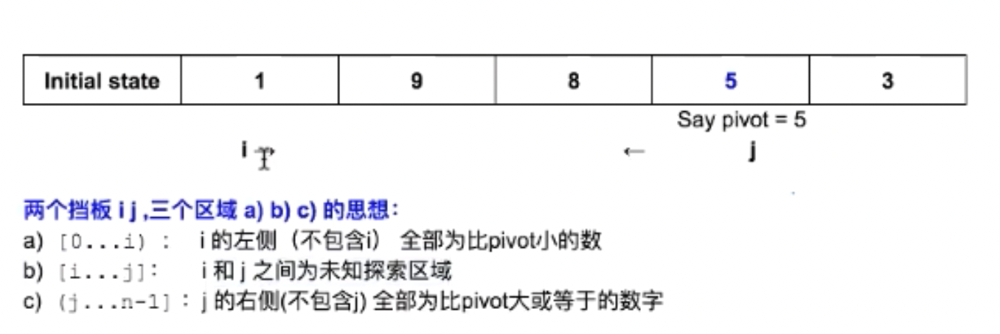
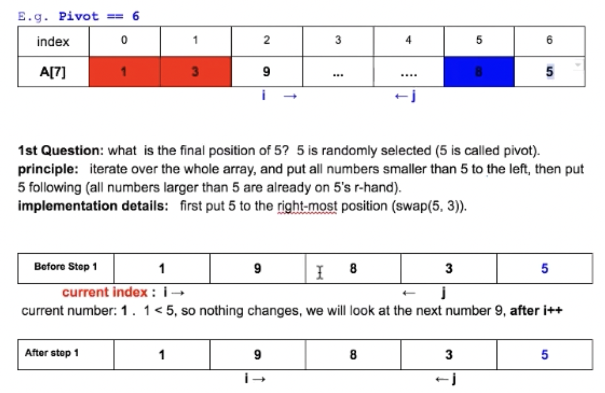
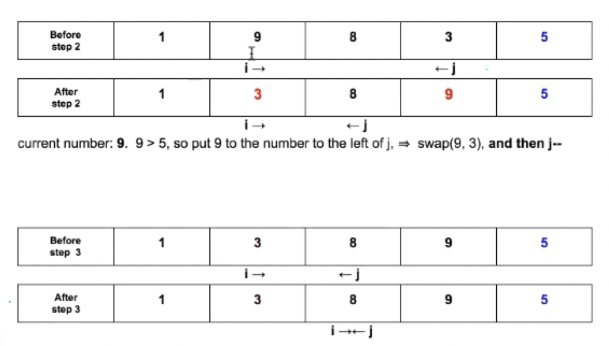
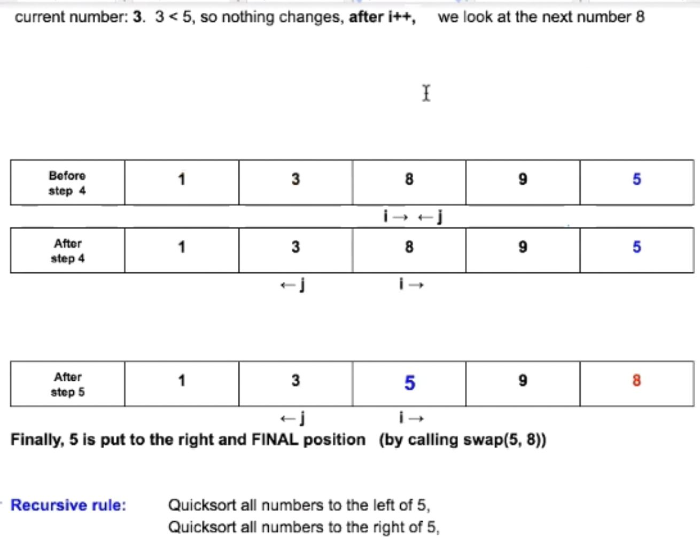
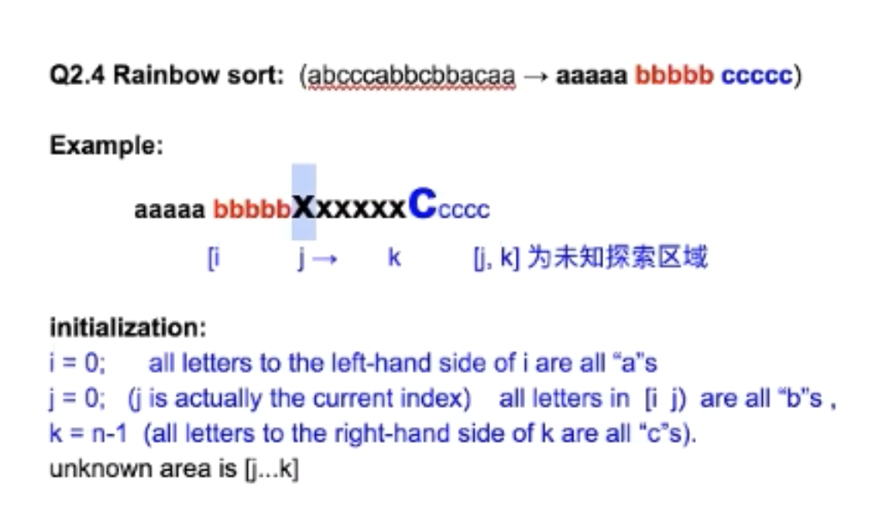

# Sorting Algorithm

### 1. Selection Sort 选择排序- O(n2)

The **selection sort algorithm** sorts an array by repeatedly finding the minimum element (considering ascending order) from unsorted part and putting it at the beginning. The algorithm maintains two subarrays in a given array.

- The subarray which is already sorted. 
- Remaining subarray which is unsorted.

In every iteration of selection sort, the minimum element (considering ascending order) from the unsorted subarray is picked and moved to the sorted subarray. 

**Time Complexity**: O(n2) as there are two nested loops:

**Auxiliary Space:** O(1) as the only extra memory used is for temporary variable while swapping two values in Array. 

The good thing about selection sort is it never makes more than O(n) swaps and can be useful when **memory write is a costly operation.** 

Discussion:

1. Given an array stored in Stack1, how to sort the numbers by additional 2 Stacks
2. Follow up, what if only 1 Stack can be used.

### 2. Merge Sort 归并排序 -O(nLogn)

Like QuickSort, Merge Sort is a **Divide and Conquer algorithm.** It divides the input array into two halves, calls itself for the two halves, and then it merges the two sorted halves. The merge() function is used for merging two halves. The merge(arr, l, m, r) is a key process that assumes that arr[l..m] and arr[m+1..r] are sorted and merges the two sorted sub-arrays into one. 

**Time Complexity**: **O(nLogn)** as total time = Logn+nLogn

**Space Complexity**: **O(n)** as this is a depth first algorithm(not nLogn), it always merge up before it gets into next tree

Total Space: n+ n/2 + n/4 + n/8 + ... + 1 <= 3n

Return后所有内存资源都会被释放

[MergeSort Space Complexity](https://stackoverflow.com/questions/10342890/merge-sort-time-and-space-complexity)

**Discussion:**

1. Can we merge sort a linked list? What is the time complexity if so?

   **Find Min for Linked list is always is O(n)**, so the total time = nLog + nLog = O(nLogn)

2. 什么是面试中一个类型的题

   a. A1B2C3D4 -> ABCD1234 : 只是combine实现方法不一样

   b. ABCD1234 -> A1B2C3D4

   c. K-way merge and it's application in MapReduce

   ​    e.g. How to merge TB/PB level data? **Algorithm + System design**

   d. Count-Array Problem

### 3. Quick Sort

Like Merge Sort, QuickSort is a Divide and Conquer algorithm. **It picks an element as pivot and partitions the given array around the picked pivot.** There are many different versions of quickSort that pick pivot in different ways. 

**Rainbow Sort: 三个挡板4个区域**

