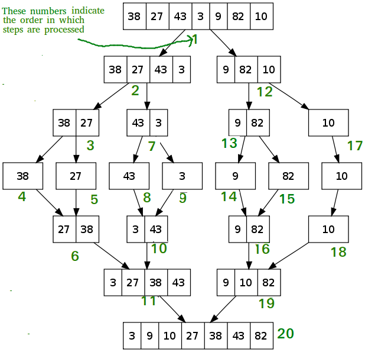

# Sorting Algorithm

### 1. Selection Sort 选择排序- O(n2)

The **selection sort algorithm** sorts an array by repeatedly finding the minimum element (considering ascending order) from unsorted part and putting it at the beginning. The algorithm maintains two subarrays in a given array.

- The subarray which is already sorted. 
- Remaining subarray which is unsorted.

In every iteration of selection sort, the minimum element (considering ascending order) from the unsorted subarray is picked and moved to the sorted subarray. 

**Time Complexity**: O(n2) as there are two nested loops:

**Auxiliary Space:** O(1) as the only extra memory used is for temporary variable while swapping two values in Array. 

The good thing about selection sort is it never makes more than O(n) swaps and can be useful when **memory write is a costly operation.** 

Discussion:

1. Given an array stored in Stack1, how to sort the numbers by additional 2 Stacks
2. Follow up, what if only 1 Stack can be used.

### 2. Merge Sort 归并排序 - 

Like QuickSort, Merge Sort is a **Divide and Conquer algorithm.** It divides the input array into two halves, calls itself for the two halves, and then it merges the two sorted halves. The merge() function is used for merging two halves. The merge(arr, l, m, r) is a key process that assumes that arr[l..m] and arr[m+1..r] are sorted and merges the two sorted sub-arrays into one. 

